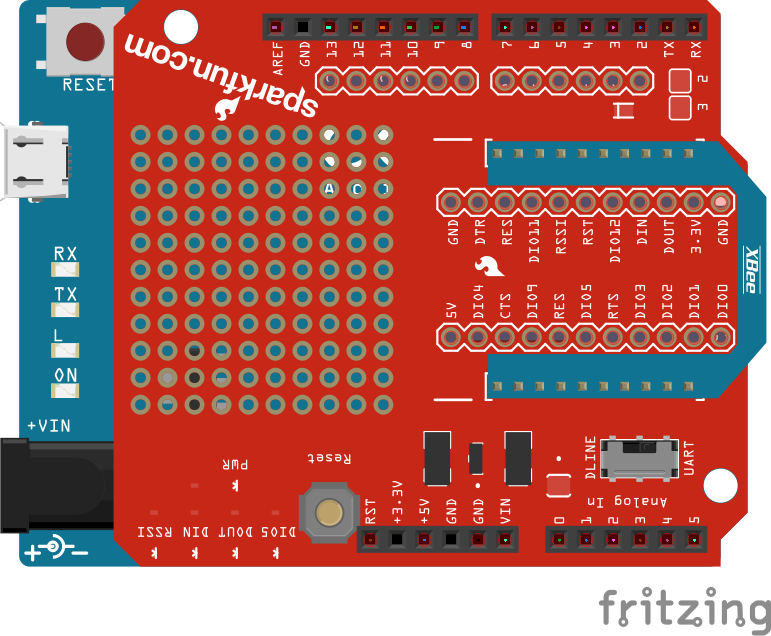

saxc-usb-transceiver
====================

Simple Arduino XBEE controller - USB HID module

## Hardware ##

* Arduino Leonardo
* XBEE Shield
* XBEE module

Fritzing schematic, see ``brd/`` folder.

## Software ##

Arduino program, see ``src/`` folder.

